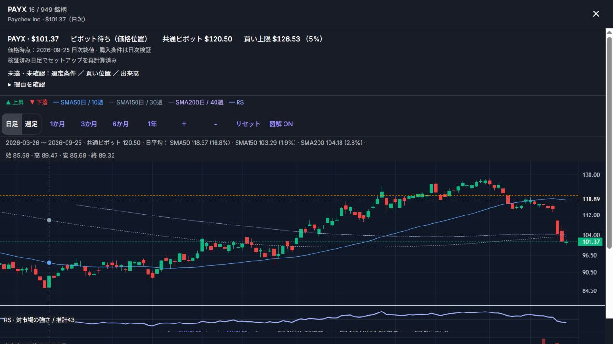
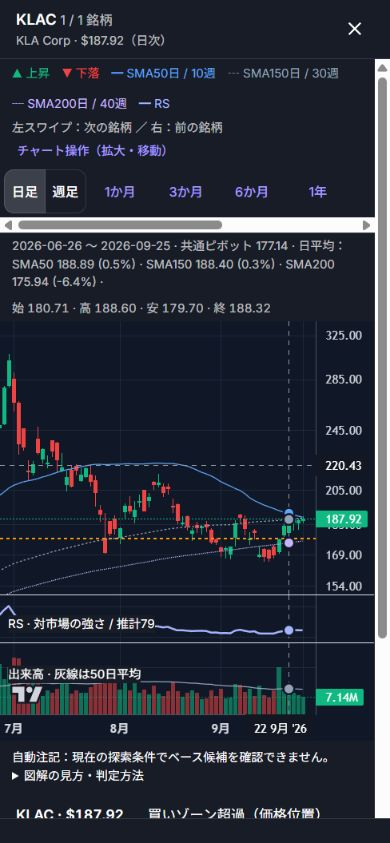

# 機関保有・通信量・セットアップ再計算の検証

2026-09-28〜29に実施。実データの分析日は2026-09-25。元の公開バンドルと変更後のバンドルを比較した。選定閾値は変更していない。

## 実装

- SECの13Fを報告運用会社のCIK単位で集計し、OpenFIGIで証券を照合する。保有株数、ファンド数、親会社グループ数とは別の数値である。保有対象期・前期差・提出日の範囲・集計公表期限・取得日時・出典を詳細画面に表示する。
- 13F-HR/AのRESTATEMENTは置換、NEW HOLDINGSは追加として扱う。重複行・オプション・債券額面を除く。対応する元報告のない追加訂正は除外する。2四半期の比較ができなければゼロや合格にしない。
- 集計には期限以前に提出された報告だけを使う。今回の公表集計期限は2026-08-31、比較対象期は2026-03-31と2026-06-30。9月の提出を含む完全な最新提出ベースではない。
- 詳細スキャンは全銘柄のフィルター・ソート・表に必要な値だけを取得し、検出器の報告や検証根拠は銘柄を開いてから取得する。各行にチャートの場所を持たせ、全体チャート索引の取得をなくした。
- 修復後のOHLCVを既存のSetupEngineScannerとMinerviniScannerに入力する。入力履歴、検出器のソース、RS母集団等のハッシュを記録し、ベース・VCP・ピボット・準備状態等を再計算する。補助スキャナーの未再計算スコアは修復銘柄で無効化する。
- ピボットと買い上限は共通の計算を使う。検出失敗時は旧ピボット・旧合格フラグを消す。チャートと詳細JSONは内容別のURLに変更し、古いキャッシュが新しい判定に混ざらないようにした。
- バックエンドのDB・Redis・取得経路で価格履歴の整合性を検査する。分割等で過去の終値が変わった場合は履歴全体を取り直し、DBの過去行も更新する。再取得失敗時は古いセットアップ入力を返さない。

## データ結果

ローカル検証版で、5,898銘柄中4,637銘柄の本番検出器の再計算に成功した。残りは履歴不足・価格断絶・取得不能等であり、旧水準を無効化した。日足検証率は流動性条件内で1,849 / 1,935（95.56%）。流動性件数は修復後の50日平均売買代金を再計算したため、旧版の1,942件とは異なる。

13Fと証券の照合は3,991証券。スクリーナー内で2期を比較できたのは3,632 / 5,898銘柄、流動性条件内では1,864 / 1,935（96.33%）。未照合や比較不能の銘柄は未確認のまま残る。

| 銘柄 | 報告運用会社数 3月末→6月末 | 差 | 日次価格 | 再計算ピボット | 買い上限 | 状態 |
|---|---:|---:|---:|---:|---:|---|
| AMD | 3,192→3,979 | +787 | 630.63 | 572.50 | 601.13 | 買いゾーン超過 |
| TSM | 3,276→3,559 | +283 | 450.61 | 435.71 | 457.50 | 価格位置はゾーン内、出来高・形状等未達 |
| JPM | 5,084→5,125 | +41 | 343.06 | 365.75 | 384.04 | ピボット待ち |
| KLAC | 2,076→2,481 | +405 | 187.92 | 177.14 | 186.00 | 分割調整済み、買いゾーン超過 |
| SLAB | 378→352 | −26 | 221.24 | 221.00 | 232.05 | 現金買収合意により購入対象外 |

金額はUSD。価格のゾーン判定は発注の合格認定ではない。ブレイク前の準備条件と、ブレイク当日の出来高条件は別の判定として表示する。

## 通信・操作の実測

同じPC、同じブラウザ、1440×1000、同じローカルgzip配信、CPU・ネットワークの人工的な制限なし。新しいポートでコールド読み込みし、変更前後を交互に3回測定した。時間・メモリは中央値。旧版は公開サイトから取得したビルドをそのまま使用した。

| 指標 | 変更前 | 変更後 |
|---|---:|---:|
| 詳細スキャンの初期データHTTP本文（圧縮後） | 5,413,554 B | 2,682,200 B |
| 展開後の初期データ | 41,776,331 B | 18,242,362 B |
| 初期データの要求数 | 9 | 8 |
| 全件読み込み・初回表描画完了 | 2,936.9 ms | 2,798.0 ms |
| 描画直後のJSヒープ（概算） | 111,466,758 B | 89,097,560 B |
| 株価で並べ替え→描画 | 307.0 ms | 269.3 ms |
| AMD検索→描画 | 129.3 ms | 113.9 ms |

初期通信は50.45%、展開後サイズは56.33%減少。表示時間の改善は4.7%で、通信量削減ほど大きくはない。ヒープ値はブラウザの概算でGCの影響を受ける。JS・CSS等は通信表の対象外。Service Workerが一部Resource TimingのencodedBodySizeを展開後サイズとして報告したため、変更後の圧縮値は同じ8 URLのHTTP Content-Lengthと受信本文長でも実測照合した。

生の3回値：

- 変更前：表示 2764.8 / 3047.6 / 2936.9 ms、ヒープ 111466758 / 105332284 / 113136203 B、並べ替え 319.3 / 306.3 / 307.0 ms、検索 129.4 / 129.3 / 127.9 ms。
- 変更後：表示 2625.7 / 2798.0 / 3167.9 ms、ヒープ 101873482 / 89097560 / 89068903 B、並べ替え 272.2 / 262.3 / 269.3 ms、検索 109.4 / 113.9 / 123.5 ms。

## 検証

- 全5,898銘柄のエクスポート済み選定結果を再計算して一致を確認。
- 一覧用と詳細用の全件フィルター・ソート結果、全件のピボット等の値を照合。実銘柄10ケースで詳細JSONとチャートの値も照合。
- PCと390×844のスマホ表示でAMD・TSM・JPM・KLAC・SLABを操作。スマホではADI、ROIV、ECOも通常チャートと拡大チャートで同じ価格・ピボット・上限を確認。ページ全体の横はみ出しなし。
- KLACの分割の崖が消えたこと、ECOの機関保有が未取得扱いでCAN SLIMのIを通過しないこと、ROIVの財務履歴不足表示、MRNAの価格断絶警告と旧水準の無効化を確認。
- 実際にCSVを保存し、5,898行・銘柄重複なしを確認。AMD/TSM/JPM/KLAC/SLABのピボットは画面と一致し、MRNAのピボットは空欄。CSVのqualifiedは選択した手法の一次選定であり、購入条件ではない。
- フロント全体は最終CIで合格（1,005テスト）。検証中に発見した未選択モーダルのエラーは修正し、回帰テストを追加した。
- lintはエラー0、既存警告8。ビルド・データ品質ゲート合格。バックエンドの履歴上書き・更新失敗テスト、フロント、Smokeを含む[最終CI（915ace2）](https://github.com/kusennjp1-ai/screener/actions/runs/36442248300)は合格。

## 残る制約と必要なもの

1. **SECの継続自動取得**：ローカルの通常HTTP取得は403となり、公式ページからダウンロードした2つのアーカイブを初期データに使った。定期取得・HTTP条件付き取得・再試行用キャッシュは実装済み。自動取得失敗は画面に表示し、180日を超える報告期は判定に使わない。公開処理のGitHub ActionsでもHTTP 403を確認したため、継続自動取得は未解消。まずGitHub Actionsの`SEC_USER_AGENT`シークレットに、運営者の実在する連絡先を含むUser-Agentを設定する。メールやAPIキーをチャットに貼る必要はない。
2. **13Fの範囲**：報告義務のない保有者・非公開保有は含まれない。運用会社数はファンド数や優良ファンドの実績ではない。書籍の機関スポンサーの質・IBDの非公開評価を完全再現したとは扱わない。これにはファンド単位の保有履歴、安定したファンドID、運用成績・評価、四半期末と公表日時、訂正履歴、公開再配布権が必要。
3. **残る機関保有の欠損**：CUSIP/CINSの未照合・複数クラスの曖昧さ・片期欠損などを継続照合する。単に取得できない銘柄を保有0と解釈しない。OpenFIGIの無料枠は10件/リクエスト・25リクエスト/分。実装は間隔を空けて利用し、照合結果をキャッシュする。
4. **TradingView契約**：公式には利用者が市場データ・指標を取り出す汎用APIを提供していない。既存の画面契約を自動取得APIの権限とは扱えない。
5. **Finnhub契約**：公式APIのinstitutional ownershipはPremium項目。Freeは月額0ドル・60回/分。確認したAll-In-Oneの表示価格は月額3,500ドル・年払いだが、これは大きなセット契約の価格であり、当該データだけの最小費用や既存契約の権限を示さない。公開再配布は商用契約の見積り確認が必要。接続キーはこの検証時にはメモリ上に存在しなかったため、ユーザー契約の認証付き応答は未確認。画面に「機関投資家APIの権限を確認」ボタンを追加し、403・429・空応答・取得成功を区別した。キーは公開ファイルやログに保存しない。

フォローアップ：実在する運営者連絡先を含むSEC_USER_AGENTを設定し、SECの無人取得が成功する実行を確認する。それでも403の場合はSECが許可する実行環境または再配布権付きの提供会社が必要。併せて未照合銘柄の追加照合、必要な場合のファンド品質データと再配布契約を確認する。これらを「全データ取得済み」や「書籍完全再現」として完了扱いにしない。

## 一次資料

- [SEC Form 13F Data Sets](https://www.sec.gov/data-research/sec-markets-data/form-13f-data-sets)
- [SEC 13Fデータ仕様](https://www.sec.gov/files/form_13f_readme.pdf)
- [OpenFIGI API仕様と制限](https://www.openfigi.com/api/documentation)
- [TradingViewのデータ取得APIに関する回答](https://www.tradingview.com/support/solutions/43000474413-i-need-access-to-your-api-in-order-to-get-data-or-indicator-values/)
- [Finnhub API](https://finnhub.io/docs/api)、[公式料金](https://finnhub.io/pricing)、[商用契約](https://api.finnhub.io/pricing-startups-and-enterprise)

## 公開確認

[公開ワークフロー36442249669](https://github.com/kusennjp1-ai/screener/actions/runs/36442249669)は成功し、2026-09-29 00:28 JSTに反映。公開URLから新しいmanifestと全6個の詳細スキャン用チャンクを取得し、5,898銘柄のピボット・価格・出来高・準備状態が候補一覧データと一致することを検証した。AMD・TSM・JPM・KLAC・SLAB・ECO・MRNA・ROIVの詳細ファイルも照合した。

最終公開版ではOpenFIGIの追加照合により、機関保有が4,099証券まで取得でき、スクリーナー内の比較可能銘柄は3,734 / 5,898、流動性条件内で1,867 / 1,935（96.49%）となった。残り68銘柄は未確認。日足検証とセットアップ再計算件数は上記のローカル版と同じ。

公開画面でもAMDのインライン・拡大チャート、機関保有数と自動更新失敗の表示を確認。390×844のスマホ表示ではKLACの共通ピボット177.14・上限186.00と分割調整済みチャートを確認し、ページの横はみ出し・コンソールエラーはなかった。詳細スキャンでも全5,898件の読み込みを確認し、PAYXを開いて詳細の遅延取得が完了すること、共通ピボット120.50・上限126.53を表示すること、コンソールエラーがないことを確認した。

初回の公開処理で、日次ワークフローの直近成功実行にPages成果物が残っていない問題を検出した。利用可能な成功済みPages成果物から復元する方式に修正し、成果物の保持期間を7日にした。分析日や市場データの時刻は新しい日付に偽装していない。
